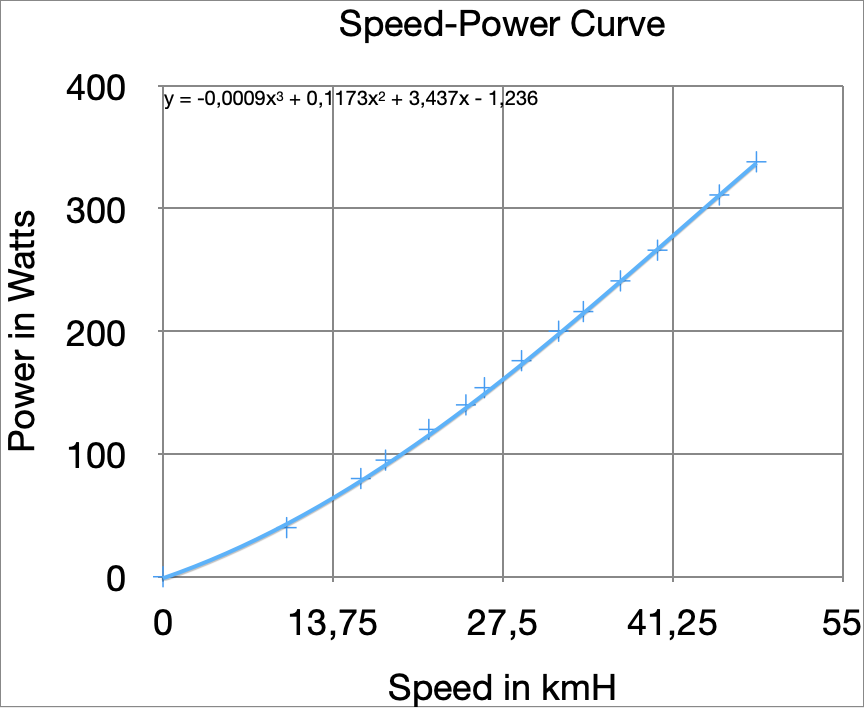

# Bluetooth Speed and Cadence Bike Sensor Client
Use a Bluetooth Speed and Cadence Sensor and siplay stats such as current speed and pedal cadence as well as total distance and duration of the exercise.

The idea of the project is to be able to display workout statistics on a screen instead of having to monitor a tiny bike-computer screen.

## Resources
* [Speed and Cadence Data Definition](https://github.com/sputnikdev/bluetooth-gatt-parser/blob/master/src/main/resources/gatt/characteristic/org.bluetooth.characteristic.csc_measurement.xml)
* [Gauge JS Component](https://bernii.github.io/gauge.js/#!)
* [Websockets](https://developer.mozilla.org/en-US/docs/Web/API/WebSockets_API)

## Estimating Power
[Trainer used](https://www.amazon.de/Elite-Rollentrainer-Novo-Mag-Force/dp/B01K52T51M)

