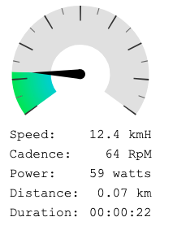
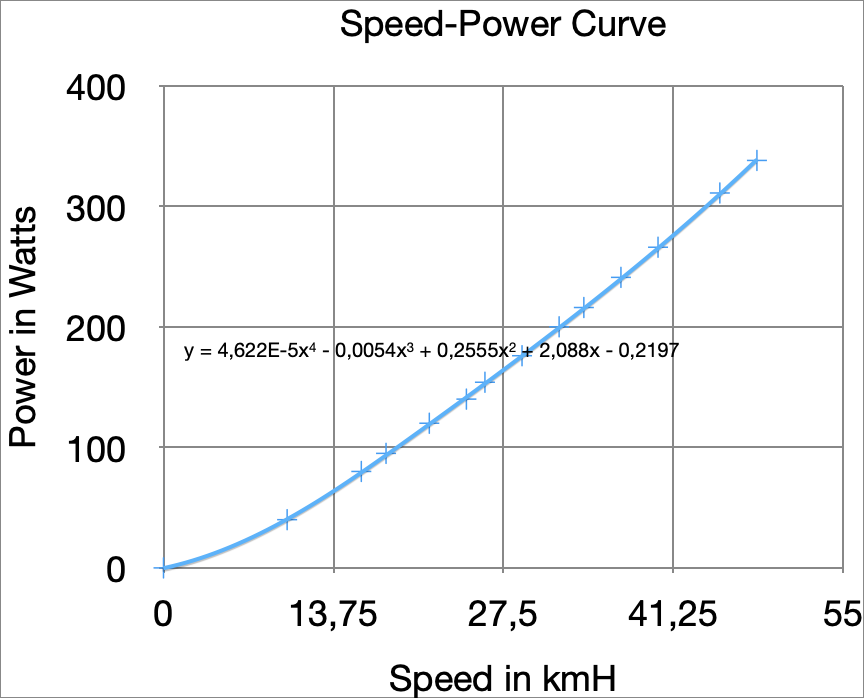
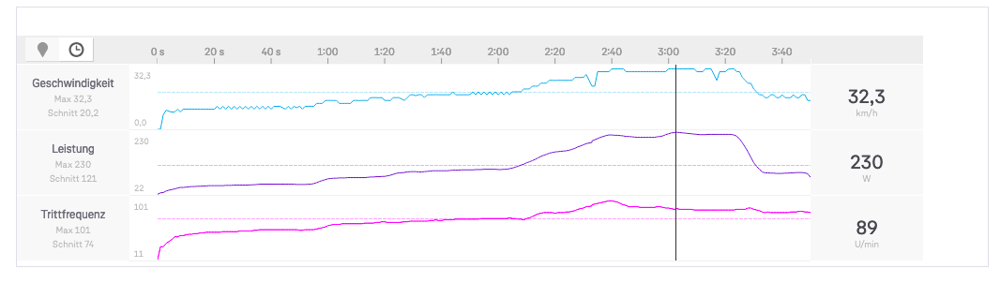

# Bluetooth Speed and Cadence Bike Sensor Client
Use a [Bluetooth (BLE)](https://en.wikipedia.org/wiki/Bluetooth_Low_Energy) Speed and Cadence Sensor and display stats such as current speed, pedal cadence and power output as well as total distance and duration of the exercise.

The idea of the project is to be able to display workout statistics on a screen / HUD instead of having to monitor a tiny bike-computer screen.



The app connects with the sensors on the bike and interpres the values returned as per data schema: [Speed and Cadence Data Definition](https://github.com/sputnikdev/bluetooth-gatt-parser/blob/master/src/main/resources/gatt/characteristic/org.bluetooth.characteristic.csc_measurement.xml).
The sensor returns the total number of wheel and crank revlutions as well as the time passed since the last reading. As the sensor values overflow regularly (the timers overflow every ~64 sec as they hold a ```uint16``` value with a resolution of ```1 / 1024``` sec), handling overflows is necessary (e.g check whether value at ```t``` is smaller than the value at ```t-1``` => add ```2^16``` to the value at time ```t```)

The backend communicates in real-time via [Websockets](https://developer.mozilla.org/en-US/docs/Web/API/WebSockets_API) with the WebApp, where the data is displayed in a user-friendly manner.

## Estimating Power output
Trainer used: [Elite Novo Mag Force 8](https://www.amazon.de/Elite-Rollentrainer-Novo-Mag-Force/dp/B01K52T51M)
#### Setting: using level 3 of 8


In order to be able to provide the user with an estimate of their power output, we used the values obtained from the official [Elite App](https://www.elite-it.com/en/products/app-software/my-e-training) and integrated them. We used the level 3rd of 8 for the tracking, but this can be adjusted in future versions (e.g by passing the level setting from the WebApp to the backend).
The power output estimation is needed to be able to allow the users to track their training ride properly (needed for total energy calculation as well as calories burnt) and will be crucial when exporting the training to [Strava](https://www.strava.com) or similar platforms.

#### Measured Power output at speed
|   speed in kmh  |   power in watts  |
|-----------------|-------------------|
|   0             |   0               |
|   10            |   40              |
|   16            |   80              |
|   18            |   95              |
|   21,5          |   120             |
|   24,5          |   140             |
|   26            |   154             |
|   29            |   176             |
|   32            |   200             |
|   34            |   216             |
|   37            |   241             |
|   40            |   266             |
|   45            |   311             |
|   48            |   338             |

## Training Export
To be able to track your training on platformas such as [Strava](https://www.strava.com), the app allows to download the training session as a [TCX](https://en.wikipedia.org/wiki/Training_Center_XML) file containing the individual sensor data points to track speed, duration and cadence along the training session.

Strava is able to parse the TCX file correctly and displays all data measured by the app.



## Resources
* [Speed and Cadence Data Definition](https://github.com/sputnikdev/bluetooth-gatt-parser/blob/master/src/main/resources/gatt/characteristic/org.bluetooth.characteristic.csc_measurement.xml)
* [Gauge JS Component](https://bernii.github.io/gauge.js/#!)
* [Websockets](https://developer.mozilla.org/en-US/docs/Web/API/WebSockets_API)

## Possible Extensions
* confirm the power calculation is correct
validate that there are no cumulative errors (e.g on the running sum fir the distance) that can disturb the tracked data
* allow changing the difficulty level on the trainer